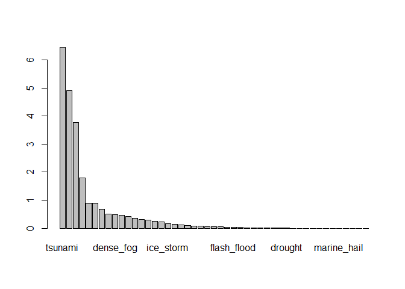

# Data Processing

We will begin, simply, by loading the data from the provided link into a local file.

```r
if(!file.exists("Data")) {dir.create("Data")}

if(!file.exists("Data/StormData.csv")) {
  download.file("https://d396qusza40orc.cloudfront.net/repdata%2Fdata%2FStormData.csv.bz2", "Data/StormData.csv.bz2")
  bunzip2("Data/StormData.csv.bz2", remove = FALSE)
  }
StormData <- read.csv("Data/StormData.csv")
```

## Preliminary Work
The first order of business on this data is the fact that not all of the data was 
actually recorded every year. In fact, even though the data starts with 1950, it 
isn't until January 1996 that all of the potential event types are present.


```r
StormData <- StormData[as.Date(StormData$BGN_DATE, format =  "%m/%d/%Y %H:%M:%S") > "1996-01-01",]
etypes <- unique(StormData$EVTYPE)
length(etypes)
```

```
## [1] 515
```

Okay, but what comes after that? Well the biggest piece of concern is that the 
data doesn't currently reflect the individual data points. There are approximately
48 of them, but as shown above, there are considerably more event types listed. 
It's not quite reasonable to list them all out here, but here is a small selection 
of the EVTYPE values containing "FLASH" like in "flash flood":


```r
unique(StormData$EVTYPE[grepl("FLASH", StormData$EVTYPE)])
```

```
## [1] "FLASH FLOOD"       "FLASH FLOOD/FLOOD" "FLASH FLOODING"   
## [4] "FLOOD/FLASH/FLOOD" " FLASH FLOOD"
```

So what to do? We're going to need some way to combine like categories and some 
concessions will need to be made. Checking through the unique EVTYPE values you 
will see that at this point there are 515 unique values for EVTYPE.

## Sorting Event Types
First, what can we excluded? Well combing through this list reveals a number of 
"Summary" values. Beyond this, it's not particularly easy to throw out any specific 
event types, unless they specifically do not wind up matching any of the specified 
48 EVTYPE values given in the documentation. Let's start by just stripping out 
these summary values to reduce the total number of values to 448. I'm planning
to throw all the extra EVTYPE values into an "other" category, so this becomes
important later.

```r
summaries_list <- tolower(etypes[grep("summary", etypes, ignore.case = TRUE)])
etypes <- etypes[!(tolower(etypes) %in% summaries_list)]
```

We will have to look at actually reducing these evtypes in the dataframe momentarily, 
but for now this is acceptable. We can begin taking a look at the list of remaining 
event types now to find what can be filtered out. From here it would be frankly
too much text to explain every little decision made for what is included anywhere.
The code I intend to use to make these lists is going to be shown below, and at 
the end each unique event type is going to have a character vector in its name 
that includes exactly the list of listed ETYPE values from the original dataframe 
that will be placed under its label.

In general, I am employing these basic guidelines to select what fits what event
type:

1. Types are opt-in. If an EVTYPE value remains afterwards, it must not have fit
any listed event type.
2. Each list should be non-intersecting to avoid duplicating data. However, if 
there is a value that equally fits two or more event types, this can and should 
be reconsidered.
3. I will endeavor to save time using broad strokes to select EVTYPE values. For
example, all values containing "tornado" should likely go in the Tornado value. 
Before doing this, of course, all such values should be checked in case something
like "ice tornado" is present (god, I hope not...).
4. After that, some values will need to be specifically sorted. Some such examples 
are the values containing "FLD" or "FLDG" which I would have absolutely missed 
with just a cursory glance.

```r
## I'm going to start by creating a simple search function to save myself the 
## effort of typing out the grep() call that I'm using for this
search_list <- function(list, s_value) {
  trimmed_list <- list[grep(s_value, list, ignore.case = TRUE)]
  return(trimmed_list)
}
## These are the types I found the easiest to filter:
avalanche <- search_list(etypes, "avalanche") ## One down, 47 to go...
drought <- search_list(etypes, "drought")
hurricane_typhoon <- c(search_list(etypes, "typh"), search_list(etypes, "hurr"))
marine_hail <- search_list(etypes, "marine hail")
marine_high_wind <- "MARINE HIGH WIND"
marine_strong_wind <- "MARINE STRONG WIND"
marine_thunderstorm_wind <- c("MARINE THUNDERSTORM WIND", "MARINE TSTM WIND")
seiche <- search_list(etypes, "seiche")
tornado <- c(search_list(etypes, "tornado"), "LANDSPOUT")
volcanic_ash <- search_list(etypes, "volcanic")
waterspout <- search_list(etypes, "waterspout")

## To make sure I don't accidentally pull in anything I decided was for the prior
## categories, I'm going to trim down the etypes list here
etypes <- etypes[!(etypes %in% c(avalanche, drought, hurricane_typhoon, marine_hail, marine_high_wind, marine_strong_wind, marine_thunderstorm_wind, seiche, tornado, volcanic_ash, waterspout))]
## This basically just says "all of etypes that isn't in any of the other lists"
```

So here's where we start to see the issues with point 2. When looking at the 
thunderstorm wind listings, we see things like "TSTM WIND AND LIGHTNING" and 
"TSTM WIND/HAIL" which are also going to fall under Lightning and Hail, obviously.
Basically, I'm going to start taking these listings, removing them from the etypes
list and readding any of these specific exceptions back to the list.

```r
dense_fog <- search_list(etypes, "og")     ## Would you believe I caught "VOG" without having to go back for it?
dense_smoke <- search_list(etypes, "smoke")
dust_devil <- search_list(etypes, "dust de")
dust_storm <- search_list(etypes, "dust")
dust_storm <- dust_storm[!(dust_storm %in% dust_devil)]
freezing_fog <- c(search_list(etypes, "freezing fog"), "Ice Fog")
dense_fog <- dense_fog[!(dense_fog %in% freezing_fog)]
funnel_cloud <- search_list(etypes, "funnel")
hail <- search_list(etypes, "hail")
lightning <- search_list(etypes, "lightning")
rip_current <- search_list(etypes, "rip")
thunderstorm_wind <- c(search_list(etypes, "thunderstorm wind"), search_list(etypes, "tstm wind"))
thunderstorm_wind <- thunderstorm_wind[!(thunderstorm_wind %in% search_list(thunderstorm_wind, "non"))]
wildfire <- search_list(etypes, "fire")
addback <- c("GUSTY WIND/HAIL", "HAIL/WIND")

## Just trying to keep this clean
etypes <- etypes[!(etypes %in% c(dense_smoke, dust_devil, dust_storm, dense_fog, freezing_fog, funnel_cloud, hail, lightning, rip_current, thunderstorm_wind, wildfire))]
etypes <- c(etypes, addback)

astronomical_low_tide <- c("ASTRONOMICAL LOW TIDE")
coastal_flood <- search_list(c(search_list(etypes, "cstl"), search_list(etypes, "coastal")), "flood")
lake_effect_snow <- search_list(etypes, "effect snow")
lakeshore_flood <- search_list(etypes, "lakeshore")
storm_surge_tide <- c(search_list(etypes, "surge"), search_list(etypes, "tide"))
storm_surge_tide <- storm_surge_tide[!(storm_surge_tide %in% astronomical_low_tide)]
tropical_depression <- search_list(etypes, "depre")
tropical_storm <- search_list(etypes, "tropical st")
tsunami <- search_list(etypes, "tsunami")

etypes <- etypes[!(etypes %in% c(astronomical_low_tide, coastal_flood, lake_effect_snow, lakeshore_flood, storm_surge_tide, tropical_depression, tropical_storm, tsunami))]

## The choice of separation between "heat" and "excessive heat" is a bit arbitrary,
## But I'm recording special heat events as "excessive" and heat waves as just "heat"
excessive_heat <- c("EXCESSIVE HEAT", "Heatburst", "Record Heat", "RECORD HEAT", "RECORD HIGH")
heat <- search_list(etypes, "heat")
heat <- heat[!(heat %in% excessive_heat)]

## All the cold stuff goes here. I'm gonna just match in bulk and let the later 
## steps sort out the duplicates. I do have a plan for that.
blizzard <- search_list(etypes, "blizz")
ice_storm <- search_list(search_list(etypes, "ice"), "storm")
winter_storm <- c("WINTER STORM", "Record Winter Snow")
frost_freeze <- unique(c(search_list(etypes, "freeze"), search_list(etypes, "frost")))
cold_wind_chill <- c("Cold", "Unseasonable Cold", "COLD", "Cold Temperature", 
          "COLD AND SNOW", "UNSEASONABLY COLD", "Prolong Cold", "Cold and Frost", 
          "PROLONG COLD", "COLD AND FROST", "COLD TEMPERATURES", "COLD WIND CHILL TEMPERATURES", 
          "UNUSUALLY COLD", "COLD WEATHER", "COLD/WIND CHILL", "WIND CHILL",
          "BITTER WIND CHILL", "BITTER WIND CHILL TEMPERATURES")
extreme_cold_wind_chill <- c(search_list(etypes, "cold"), search_list(etypes, "chill"), search_list(etypes, "Hypothermia"))
extreme_cold_wind_chill <- extreme_cold_wind_chill[!(extreme_cold_wind_chill %in% cold_wind_chill)]
sleet <- search_list(etypes, "sleet")
heavy_snow <- c("HEAVY SNOW", "Record Winter Snow", "Heavy snow shower", 
                "Record May Snow", "Thundersnow shower", "RECORD SNOWFALL", 
                "EXCESSIVE SNOW", "RECORD SNOW", search_list(etypes, "squall"))
## And after some debate with my rubber duck, everything left over is going to 
## be tossed into the "winter weather" section. So literally everyting with
## "cold", "snow", "freez[e/ing]", etc goes in here. Then just filter out like
## I've been doing with "evtype"
winter_weather <- c(search_list(etypes, "cold"), search_list(etypes, "snow"), 
                    search_list(etypes, "freez"), search_list(etypes, "ice"), 
                    search_list(etypes, "icy"), search_list(etypes, "winter"),
                    search_list(etypes, "wintry"))
winter_weather <- winter_weather[!(winter_weather %in% c(blizzard, ice_storm, 
                    winter_storm, frost_freeze, cold_wind_chill, 
                    extreme_cold_wind_chill, sleet, heavy_snow))]
etypes <- etypes[!(etypes %in% c(heat, excessive_heat, blizzard, ice_storm, winter_storm, 
                                 heavy_snow, frost_freeze, cold_wind_chill, 
                                 extreme_cold_wind_chill, sleet, winter_weather))]
```

That was a lot of code, so let's take a moment to dive into exactly what I did:

There were really 3 sections: some easy filters, heat, and cold. The easy filters
are just like the ones I'd done before. Essentially, I find a specific term or two 
that filters out only exactly the values I think are important, or something that 
gets very close and add in the specific values missing.

The heat events section is a good example of what I'll be doing a few times going
forward. What actually qualifies as "heat" or "excessive heat" is up to speculation. 
As stated in the comments in the code, the "heat" values I chose were things that 
are somewhat typical. A heat wave isn't normal, but it's really just hot. If it 
gets into a situation like the heat wave that struck England in the summer of 
2022, then it should be listed under excessive heat if this data is reliable. It 
technically does qualify for both, but this is a concession that needs to be made 
because I simply cannot filter through every major weather event of the last several 
decades to find what actually deserves to be listed where (not that I'd necessarily 
be any more accurate anyways). 

Finally, cold events were the trickiest. This was a lot of manual listing of the 
events, because you can't just say one exact term to summarize what a storm is 
or what heavy snow really falls to. Another person would absolutely make different 
decisions here. That's okay! Data analysis is unfortunately not an exact science 
the data is cleaned (and even afterwards, don't get me started on statistical 
significance). The decisions I've made are somewhat arbitrary, but they will allow 
for a general understanding of what is and isn't really impactful within the 48 
given categories.


```r
high_surf <- search_list(etypes, "surf")
flood <- c(search_list(etypes, "fld"), search_list(etypes, "flood"))
flash_flood <- search_list(flood, "flash")
flood <- flood[!(flood %in% flash_flood)]

## Okay, look. The difference between "high" and "strong" wind is a hilarious notion.
## Actually? Forget that. According to the internet, this is a nonsense notion.
## High and Strong winds are identical colloquially and I cannot find a strict 
## difference between them. My decision here is that all wind categories will be 
## thrown into one category, strong winds.
strong_wind <- c(search_list(etypes, "wind"), search_list(etypes, "wnd"))

heavy_rain <- c(search_list(etypes, "rain"), search_list(etypes, "tstm"), search_list(etypes, "thund"))
heavy_rain <- heavy_rain[!(heavy_rain %in% c(search_list(heavy_rain, "low"), search_list(heavy_rain, "freez"), search_list(heavy_rain, "month")))]

debris_flow <- search_list(etypes, "slide")

etypes <- etypes[!(etypes %in% c(high_surf, flood, flash_flood, strong_wind, heavy_rain, debris_flow))]
```

That's all the sorting I'm doing on this front. About the way this all went, there
are quite a few different event types sorted into 2-3 different categories from 
the given list. I wound up with one category entirely excluded from the 
final list: "high wind". Additionally, there are 93 total 
unique values from the original etypes set that aren't used in any of the 47 
remaining categories. I looked over these values directly, putting values I 
thought fit another category in directly. Beyond that, there doesn't appear to 
be anything that directly fits the categories as I've marked them. Seeing as 
there are so many remaining values, it wouldn't be reasonable to try to put them 
into an "other" category. I'll just have to let these go, I'd reckon.

## Reshaping the Data

If you're just tuning in, right now I've taken all of the Event Types in the 
original dataframe and sorted them into lists with the name of all of the event 
types from the list at the true source of the data. You can find that list on
page 6 of [this document](https://d396qusza40orc.cloudfront.net/repdata%2Fpeer2_doc%2Fpd01016005curr.pdf).
As stated in the last section, "high wind" isn't included in the list because I 
was unable to find a specific way to differentiate between "high wind" and 
"strong wind". This leaves 47 categories to be looked at. 

With that said, here's what I'm planning to take care of in this section. I need
a dataframe in the same general form as the StormData dataframe from earlier, but
with a few differences:

1. Each row should have its EVTYPE value set to whatever it matches with the lists
created earlier, including duplicating rows whenever necessary.
2. Unnecessary columns need to be pruned. The prompt for this write up specifies 
the entire United States, so location is one example of something to be removed 
from the dataframe. 
3. From what I can tell, the data for actual agricultural damage data is sorted 
as essentially scientific notation, with one column representing the value to be 
multiplied by the exponent in another column. For example, a certain row lists 
"38" as the base value and "K" as the exponent. This would translate into 38,000 
in crop damages. This means we're gonna need a new column dealing with this 
specific transformation value.
  + Regarding the casualties data, it is all stored in a more normal method, so 
  this sort of transformation is needless.
  
With that all set, let's start by making a list that will make all of this a lot 
easier. In doing this, I'll be setting all of the list values as names that can 
be referenced. This means I can call the character vectors from the list by name
which will come in handy later as I plan to use those variable names themselves.

```r
etype_categories <- list(astronomical_low_tide = astronomical_low_tide, 
  avalanche = avalanche, blizzard = blizzard, coastal_flood = coastal_flood, 
  cold_wind_chill = cold_wind_chill, debris_flow = debris_flow, dense_fog = dense_fog, 
  dense_smoke = dense_smoke, drought = drought, dust_devil = dust_devil, dust_storm = dust_storm, 
  excessive_heat = excessive_heat, extreme_cold_wind_chill = extreme_cold_wind_chill, 
  flash_flood = flash_flood, flood = flood, frost_freeze = frost_freeze, funnel_cloud = funnel_cloud, 
  freezing_fog = freezing_fog, hail = hail, heat = heat, heavy_rain = heavy_rain, 
  heavy_snow = heavy_snow, high_surf = high_surf, hurricane_typhoon = hurricane_typhoon, 
  ice_storm = ice_storm, lake_effect_snow = lake_effect_snow, lakeshore_flood = lakeshore_flood, 
  lightning = lightning, marine_hail = marine_hail, marine_high_wind = marine_high_wind, 
  marine_strong_wind = marine_strong_wind, marine_thunderstorm_wind = marine_thunderstorm_wind, 
  rip_current = rip_current, seiche = seiche, sleet = sleet, storm_surge_tide = storm_surge_tide, 
  strong_wind = strong_wind, thunderstorm_wind = thunderstorm_wind, tornado = tornado, 
  tropical_depression = tropical_depression, tropical_storm = tropical_storm, tsunami = tsunami, 
  volcanic_ash = volcanic_ash, waterspout = waterspout, wildfire = wildfire, 
  winter_storm = winter_storm, winter_weather = winter_weather)

names(etype_categories)[2]
```

```
## [1] "avalanche"
```

```r
etype_categories[2]
```

```
## $avalanche
## [1] "AVALANCHE"
```

As the output shows, the names of the list elements correspond to the category of 
that element's character vector. The trick here is going to be to iterate through 
the list using a numeric vector of length 47 so that the names can be referenced 
to replace the ETYPE in the StormData dataframe. Also, the second output comes back
as a list after being retreived even though it was initially a vector when I put
it into the parent list. It's a quick fix with unlist(), but I thought it worth
mention for anyone looking to learn from this (but honestly I'm pretty sure nobody
else in the world will ever read this part...).

Regarding columns, I'm looking to keep a few different columns from StormdData. 
Obviously, the data about casualties and damage numbers is important. Also, the 
REFNUM column might come in handy as an ID value. I'll keep it around, just in 
case.

```r
StormData_skinny <- StormData[,c("EVTYPE", "MAG", "FATALITIES", "INJURIES", "PROPDMG", "PROPDMGEXP", "CROPDMG", "CROPDMGEXP", "REFNUM")]

StormData_Remastered <- StormData_skinny[FALSE,]
for (i in 1:length(etype_categories)) {
  current_etype <- StormData_skinny[unlist(lapply(etype_categories[i], function(x) StormData_skinny$EVTYPE %in% x)),]
  current_etype$EVTYPE <- names(etype_categories[i])
  StormData_Remastered <- rbind(StormData_Remastered, current_etype)
}
```

This piece of code is created a dataframe that has only the necessary columns and
has the value of EVTYPE reassigned to be only the 47 different categories collected 
in the previous section. All that we're missing is a translation of the current
damage values given in the original dataframe into something that we can actually
use. Doing `unique(c(StormData_Remastered$PROPDMGEXP, StormData_Remastered$CROPDMGEXP))`
spits out 5 total: values K, M, B, 0, and an empty string. Based on [a provided resource in the course discussion for this project](https://rstudio-pubs-static.s3.amazonaws.com/58957_37b6723ee52b455990e149edde45e5b6.html), 
these translate exactly like you might expect. Namely, K, M, and B correspond to
one thousand, million, and billion.

```r
StormData_Remastered <- StormData_Remastered %>%
  mutate(PROPDMGCOMBINED = case_when(
  PROPDMGEXP == "K" ~ PROPDMG * 1000,
  PROPDMGEXP == "M" ~ PROPDMG * 1000000,
  PROPDMGEXP == "B" ~ PROPDMG * 1000000000,
  TRUE ~ PROPDMG
  ))

StormData_Remastered <- StormData_Remastered %>%
  mutate(CROPDMGCOMBINED = case_when(
  CROPDMGEXP == "K" ~ CROPDMG * 1000,
  CROPDMGEXP == "M" ~ CROPDMG * 1000000,
  CROPDMGEXP == "B" ~ CROPDMG * 1000000000,
  TRUE ~ CROPDMG
  ))
```

With that, the data is wrangled and processed, and we're ready to actually do the 
analysis. We have 11 total columns covering the type of event, the magnitude, and
the actual damages of the event. Plus the ID. At this point we can finally perform 
some proper analysis on the data.

# Results

Now that the data has been reshaped to be usable for analysis, we need to lay 
the foundation for the actual analysis to be done. So, there is a hard limit of 
3 figures for this analysis (for those confused, this file is a response to a
prompt provided on the Reproducible Research course on Coursera, and that is 
part of the rubric), which means those three need to be planned specifically.
Here's where I want to take them:

1. The first figure should be an overview of the general results for both 
categories. Since a dual-plot figure is allowed, I intend to show one plot for 
the casualties and one plot for each category of property damage. This is going
to be an overview of the entire set of categories. I'll go into detail at the 
start of the next section.
2. The second figure will be the output that strictly compares the health effects
of these events. The idea is to select a specific subset of the previous 47 
categories to be featured in this figure to show the most harmful event types.
3. Lastly, the third figure is intended to be the same situation as the second
but for the total damage done by the events in economic terms. 

## Analysis

The first piece of analysis needs to be something to compare the different 
categories to see what categories present as the worst. To do this, I'm going to
need to select a relevant measure for each piece of data. I generally believe 
percentiles to be the more broadly useful spot measure of a distribution compared 
to means, however in this instance I think I will be taking a split approach. To 
understand why I find this necessary, consider the weather events you may have 
experienced recently that stood out. 

I am a resident of Texas, so I'll be using some location-specific references, but 
there will be examples for each area. When you think extreme weather in Texas, 
you think tornadoes. Tornadoes mean property damage and injuries, but not always
both. The news always, highlights these tornadoes and the wreckage they can leave
behind, but not all of them are catastrophic. Personally, an EF0 tornado once passed
through my neighborhood, and I didn't know until later that week when roofers came
knocking door to door doing repairs (only time a solicitor has ever been useful?).
Nobody was hurt, but when I went to take a look just 1000 feet away, it was plain
as day that something had happened. But nobody was hurt. Compare that to the 
intensity of several other levels of tornado under the standard EF0-EF5 
classification and you'll notice that actually, it's not until you hit EF3 that 
these tornadoes really start becoming deadly. Lower levels of tornado can and do
still cause significant injury or fatalities, but the health risk doesn't become 
serious until you reach a certain level of intensity. But the property damage is 
always there, and the crop damage is always there.

So what's my point? Well, my point is that property damage always happens, but
until you reach the point where a certain intensity on a lot of these events is 
reached (temperatures over 105 degrees, winds that can tear apart a home, ice
making roads significantly dangerous or damaging infrastructure, to name a few)
that lives are at risk. Contrary to that, the damage to crops and property is
much more continuous. Ultimately what this means is that I believe the optimum 
choice to compare between these categories on my initial is to use the mean 
value for the injury and fatalities data while utilizing percentiles for the 
property and crop damage. This is only for the initial cursory overview, but I 
think it'll make for a good benchmark.

So what I am going to need will be a list containing the event type and its 
corresponding 25th, 50th, and 75th percentile values or its corresponding mean, 
depending on the data point being used at that moment. This needs to be done for
fatalities (mean), injuries (mean), property damage (percentile), and crop damage 
(percentile). Alternatively, I could not use the list, and instead use some sort
of data object that's designed to keep the data about individual observations 
stored in individually organized rows. You know, a dataframe.


```r
StormData_Remastered <- StormData_Remastered %>% mutate(TOTALDAMAGE = CROPDMGCOMBINED + PROPDMGCOMBINED)

spot_metrics <- data.frame(matrix(nrow = 0, ncol = 6))

for (name in unique(StormData_Remastered$EVTYPE)) {
  spot_injuries <- mean(StormData_Remastered[StormData_Remastered$EVTYPE == name, "INJURIES"])
  spot_fatalities <- mean(StormData_Remastered[StormData_Remastered$EVTYPE == name, "FATALITIES"])
  
  T25 <- quantile(StormData_Remastered[StormData_Remastered$EVTYPE == name,"TOTALDAMAGE"], probs = 0.25)
  T50 <- quantile(StormData_Remastered[StormData_Remastered$EVTYPE == name,"TOTALDAMAGE"], probs = 0.5)
  T75 <- quantile(StormData_Remastered[StormData_Remastered$EVTYPE == name,"TOTALDAMAGE"], probs = 0.75)
  
  new_row <- c(name, spot_injuries, spot_fatalities, T25, T50, T75)
  
  spot_metrics <- rbind(spot_metrics, new_row)
}
names(spot_metrics) <- c("EVTYPE", "MEAN_INJURIES", "MEAN_FATALITIES", "T25", "T50", "T75")
```

I have the data collected, now to plot it. The plan is for one plot for each 
of the four data focuses to have a single plot apiece. I intend to take the data 
and sort it into something resembling a bar plot for the two mean values, and a 
stacked bar plot for the percentile data. Lastly, I'm going to sort the data by 
descending, using the 75th percentile as the sort for the damage values.

As an additional note, I took a look here at the crop damage data. Frankly, it's
not actually much at all. I'm not really interested in differentiating between 
crop damage and property damage to begin woth, so I'm going to combine them into 
a total damage section. That transformation was thrown in just before the creation 
of the spot_metrics dataframe.


```r
spot_metrics <- spot_metrics[order(spot_metrics$MEAN_INJURIES, decreasing = TRUE),]
injuries_plot <- barplot(as.numeric(spot_metrics$MEAN_INJURIES), names.arg = spot_metrics$EVTYPE)
```

<!-- -->

```r
spot_metrics <- spot_metrics[order(spot_metrics$MEAN_FATALITIES, decreasing = TRUE),]


spot_metrics <- spot_metrics[order(spot_metrics$T75, decreasing = TRUE),]
```
